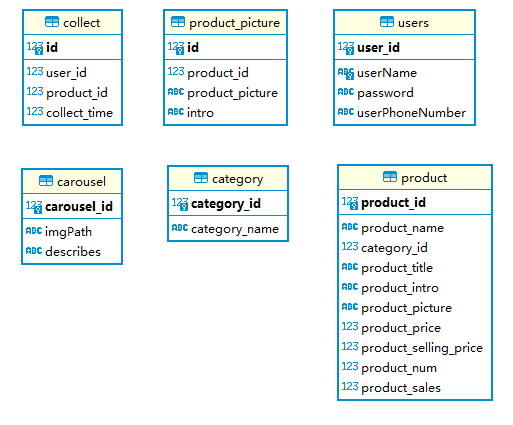
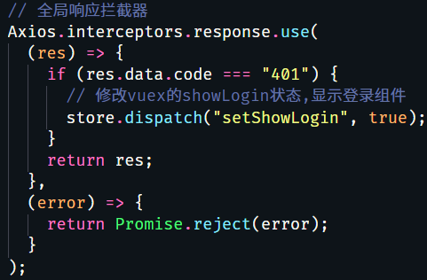

## mi-store-server

> 仿小米商城后端部分，参考的原始项目为[hai-27/store-server](https://github.com/hai-27/store-server)

导入依赖：`npm intall`

运行项目：`npm run serve`

打包项目：`npm run build`

执行两个 sql 文件，建表并插入数据，修改 `config.js` 中 `dbConfig` 的数据库信息

------

### 概述

后端基于 koa2 框架，工具栈：

- 框架：koa
- 请求体解析：koa-body
- 跨域：koa2-cors
- 静态资源处理：koa-static
- jwt 生成：jsonwebtoken
- jwt 验证：koa-jwt
- 路由：koa-router

数据表设计，因为没有实现订单和购物车，实际用到的数据表如下



### 中间件

参考链接：

- [[译\] 掌握 Koa 中间件](https://hijiangtao.github.io/2017/11/10/Mastering-Koa-Middleware/)
- [Nest.js 和 koa 有什么不一样？ - 余腾靖的回答 - 知乎](https://www.zhihu.com/question/323525252/answer/937101214)
- [koaComposeTest](https://github.com/niexq/koaComposeTest)

koa2 本身只提供封装好 http context、request、response 等核心中间件以及基于async/await的中间件容器，其余的业务逻辑都依赖于自己使用 async/await 语法编写中间件；Koa Context 将 node 的 request 和 response 对象封装到单个对象中，为编写 Web 应用程序和 API 提供了许多有用的方法。

当请求开始时，请求流依次通过中间件，当一个中间件调用 `await next()`，则该异步函数暂停并将控制传递给定义的下一个中间件，中间件在执行过程可以修改` ctx.response`，当下游没有更多的中间件执行后，堆栈将展开并且每个中间件恢复执行其上游行为。

**本质上中间件就是一个个异步函数，请求经过层层中间件获取数据，数据经过层层中间件最终包装成完整响应返回到客户端** 。这就是大名鼎鼎的洋葱模型。


我在 app.js 中引入中间件的顺序如下

```javascript
// cors中间件
const cors = require("koa2-cors");
app.use(cors());

// 响应格式化中间件(含错误处理)
const restify = require("./app/middleware/rest");
app.use(restify(pathPrefix));

// 静态资源处理中间件
const KoaStatic = require("koa-static");
app.use(KoaStatic(staticDir));

// 请求体处理中间件
const koaBody = require("koa-body");
app.use(koaBody(koaBodyConfig));

// 注册拦截器
const koajwt = require("koa-jwt");
app.use(
  koajwt({ secret: koajwtConfig.secret }).unless({
    path: koajwtConfig.whitelist,
  })
);

// 路由中间件
const routers = require("./app/routers/index");
app.use(routers.routes()).use(routers.allowedMethods());

app.listen(port, () => {
  console.log(`服务器启动在${port}端口`);
});
```

总结 koa2 中间件执行模式

- **中间件如何加载：** 使用 app.use() 时，会将中间件推入 middleware 数组，调用 listen() 会创建一个 server，传递 callback() 作为监听到请求后的处理回调，后者调用 componse 串联所有中间件，并返回真正的请求回调 handleRequest

```javascript
callback() {
  const fn = compose(this.middleware);       // 重点关注此行代码

  if (!this.listenerCount('error')) this.on('error', this.onerror);

  const handleRequest = (req, res) => {
    const ctx = this.createContext(req, res);  // 此处创建context
    return this.handleRequest(ctx, fn);
  };

  return handleRequest;
}
```

- **中间件如何执行** ：请求抵达后，触发 handleRequest，创建 context 对象，执行 compose() 的返回结果，在其中通过 dispatch() 递归调用存在 this.middleware 数组里的中间件，中间件通过 next() 切换执行流

### 数据库

koa2 中使用 mysql 需要自己使用 `async/await` 封装下：mysql 模块的操作都是异步操作，先创建连接、后查询，每次操作的结果都由 `resolve()` 包装响应给上层

```javascript
const mysql = require("mysql");
const { dbConfig } = require("../../config");
const pool = mysql.createPool(dbConfig);

const db = {};
db.query = function (sql, params) {
  return new Promise((resolve, reject) => {
    pool.getConnection((err, connection) => {
      if (err) resolve(err);
      else {
        connection.query(sql, params, (err, rows) => {
          if (err) reject(err);
          else resolve(rows);
          connection.release();
        });
      }
    });
  });
};

module.exports = db;
```

### 格式化响应 & 错误处理

formatter.js 是用于格式化响应并实现错误处理的自定义中间件

**中间件引入位置：** 和 `koa-cors` 一样，放在其余中间件之前，当作为最上游的中间时，在开始处调用 await next()，暂停当前函数执行，先去执行下游中间件，koa-static、koa-bodyparse、koa-router-controller-dao-db 完成业务数据的查询，在下游中间件中修改 ctx.body，之后自下而上再将结果返回或者抛出错误，当控制流回到 formatter 上，ctx.body 中已经放置了结果，此时可以重写 ctx.body 格式，完成格式化

**错误处理：** 当下游中间件抛出错误后，异步函数会返回 rejected promise，而上游的 await 会解包（unwrap）该拒绝态 promise，从而传递该 Error，因此在 formatter.js 使用 catch 语句即可自顶层捕获中间的所有异常

简要说下错误处理逻辑

1. koa2 中初始化 ctx.status 为 404，只要响应链条中未修改 ctx，则最后 `ctx.response.status === 404`，将此视为路由失配情况，手动抛出 `ApiErrorNames.NOT_FOUND`（未找到接口）
2. 当 `await next()` 接收到 rejected promise，解包后传递下游 Error
3. catch 中判断以上的 Error 是否为 ApiError

1. 1. 当是一个 ApiError 时，此时错误通常来自 controller（收藏重复、登陆错误等），此时依旧响应 HTTP 200，但对响应体的自定义状态码进行修改，修改为抛出的 error.code
   2. 当不是一个 ApiError，且 error.status 为 401，此时一定来自于 koa-jwt 中间件，此时依旧响应HTTP 200，但对响应体的自定义状态码修改为 401，前端的响应拦截器通过判断 res.data.code 是否为 401 来验证 token 是否过期
   3. 当不是 ApiError 错误，且没有 error.status，则该错误可能因为前端查询参数传递有误，导致 dao 层 sql 执行或 controller 执行过程中抛出错误，对于此类错误，统一以 HTTP 400 响应，表示当前错误由于前端请求问题导致

```javascript
/*
 * @Description:格式化响应结果
 * @Author: Nep
 * @Date: 2020-12-17 18:51:29
 * @LastEditTime: 2020-12-25 22:33:58
 */
const ApiError = require("./error/api_error");
const ApiErrorNames = require("./error/api_error_name");

const formatter = (pathPrefix) => async (ctx, next) => {
  try {
    // 请求前缀/api,需格式化响应
    if (ctx.request.path.startsWith(pathPrefix)) {
      // 先执行路由
      await next();
      // 任何路由失配错误，抛出ApiError
      if (ctx.response.status === 404) {
        throw new ApiError(ApiErrorNames.NOT_FOUND);
      } else {
        ctx.body = {
          code: "success",
          message: "成功",
          result: ctx.body,
        };
      }
      // 当请求前缀非/api，说明是静态资源请求，无需格式化响应
    } else await next();

    // 错误捕获：分为三类
  } catch (error) {
    // ApiError
    // 处理：将错误信息添加到响应体中返回，前端状态码依旧为200
    if (error instanceof ApiError) {
      ctx.body = {
        code: error.code,
        message: error.message,
      };
      // 401错误：专门处理koa-jwt鉴权报错
      // 处理：将401放在响应体code中，前端状态码保持200
    } else if (error.status == 401) {
      ctx.body = {
        code: "401",
        message: "请登录后操作",
      };
      // 其余类型错误
      // 处理：将错误信息添加到响应体中返回，前端状态码变成400
    } else {
      ctx.status = 400;
      ctx.body = {
        code: error.name,
        message: error.message,
      };
    }
  }
};
module.exports = formatter;
```

小结：上述使用的 HTTP 状态码只有 200、400，对于 404 响应和 401 错误进行了额外包装后设置了 `ctx.response.body.code`，但它们的 HTTP 状态是 200。**这样做是因为客户端本来就不需要关心底层错误。需要处理展示给用户的只有业务逻辑内发生的错误提示，譬如登录验证失败、数据编辑操作失败等等。** 比如项目里前端的 main.js 中就是判断 `res.data.code` 是否有权限，这种**底层协议和应用规范间的差距** 需要体会。

